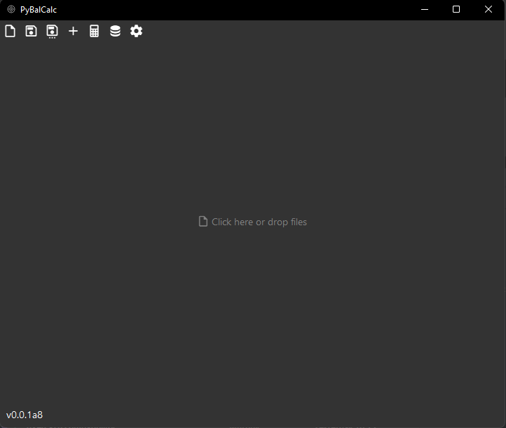
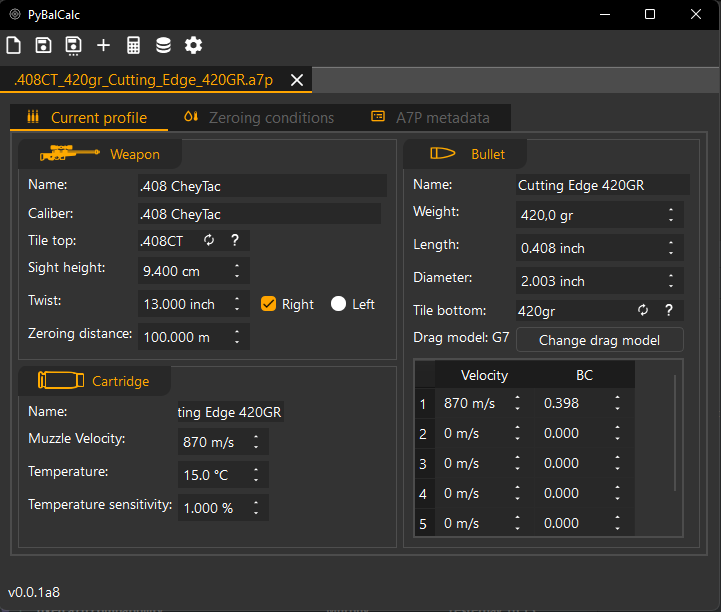
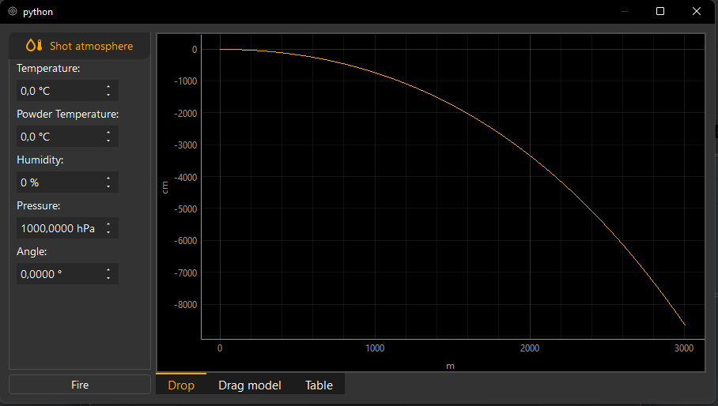
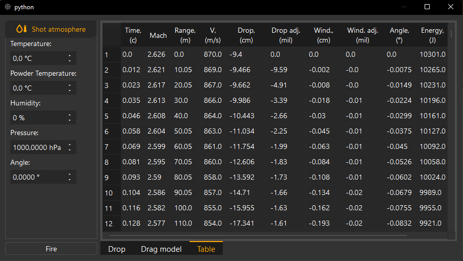

# py-balcalc
desktop gui for py-ballisticcalc library

* [Installation](#installation)
* [Profiles galery](#profiles-gallery)
* [Screenshots](#screenshots)
* [Todo](todo.md)

## Installation

Clone from GitHub
```shell
git clone https://github.com/o-murphy/py-balcalc
cd py-balcalc
python -m venv venv
venv/bin/activate
pip install -r requirements
# run
python -m py_balcalc.main
```

Or use pip
```shell
pip install py-balcalc
# run
py_balcalc
```

## Profiles gallery

## Screenshots

[//]: # ()



